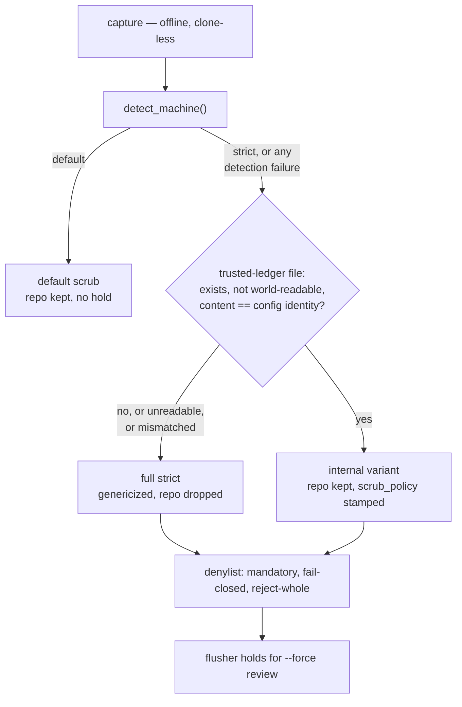

# Multi-ledger papercuts: destination trust, not record routing

Date: 2026-08-31. Status: design, not built. Supersedes nothing; extends the
privacy model in `docs/privacy.md` and the profile model in
`docs/architecture.md`.

## The question asked, and the answer found

The request was routing: run papercuts against two ledgers, personal and work,
and route each record to the ledger where its fix lives.

The design that came out has no router. Discovery found that the record's
destination is already decided correctly by the machine it was captured on,
and that the thing actually broken is unrelated to routing: the strict
profile scrubs records for an untrusted destination even when the destination
is a private team repo that is safe for the content being scrubbed away.

So the deliverable is a **destination trust level**, not a router.

## What discovery established

Five questions, answered in order of impact.

**1. What is the work ledger for?** Both confidentiality (work-derived text
must not leave work infrastructure) and audience (a work team triages it).
They coincide in almost every case. Confidentiality wins wherever they
disagree.

**2. Are the machines disjoint?** Mostly, leaking one way. The work machine
also carries personal and OSS work — dotfiles, plugins, this repo. The
personal machine never sees work code. Every routing decision therefore lives
on the work machine, which is the strict profile. The personal machine needs
nothing.

**3. Who reads each ledger?** The work ledger is a private repo with shared
team access. The personal ledger is private to one person. Misroute costs are
asymmetric but neither is public: a personal record in the team queue is
noise; work text in a personal repo is a policy problem.

**4. Can one papercut live in both ledgers?** No. One home per machine, and
"the fix lives elsewhere" is recorded at triage as an `out-of-scope` or
`reported-upstream` resolution carrying a `fix_url`. The schema already
requires that URL, and `docs/schema.md` names this exact case: "friction found
in one repo is often perfectly fixable, just not from the repo you are
standing in." Cross-boundary fixes are tracked by a pointer to the fix repo's
own tracker, which is visible from every machine.

**5. What about degraded records on the work machine?** This question
dissolved into the reframe below.

## The reframe

**Strictness is modelled as a property of the machine. It is a property of
the (machine, ledger) pair.**

`prompts/extractor-prompt.md:5-7` defines strict as "an operator has declared
that records from this machine may describe confidential work."
`docs/privacy.md:3` opens with "read this before you point the pipeline at
confidential work." Neither asks whether the _destination_ is a safe place for
that work. They did not have to: there was one ledger per machine, so "is this
destination trusted for work text" was a constant, and the constant got baked
into the machine profile.

Two ledgers make it a variable, and the baked-in constant is now wrong for one
of them.

Unbundled against a private, team-access ledger on work infrastructure:

| Strict behavior                                                                     | Against an internal ledger                                                    |
| ----------------------------------------------------------------------------------- | ----------------------------------------------------------------------------- |
| Extractor genericizes; drops rather than names (`prompts/extractor-prompt.md:9-20`) | Counterproductive. The audience is the team, who already know the repo names. |
| Gate drops `repo` and `session_id` (`docs/schema.md:42-43`)                         | Counterproductive, same reason.                                               |
| Denylist mandatory, fail-closed, reject-whole                                       | Still wanted. Its job shifts — see "Premises that multi-ledger breaks".       |
| Flusher holds for `--force` review (`docs/privacy.md:145`)                          | Retained. It is the compensating control for the temporal hole below.         |

The concrete symptom: a session in `papercuts-plugin` on the work machine
produces a team-ledger record that cannot name the repo, the file, or any
identifier. It reads like "a validation step rejected input without naming the
failing field." True, safe, unactionable. And per the prompt's last rule —
"when in doubt, drop it" — the more specific the friction, the likelier the
record never exists at all.

## The design

### 1. A trust file gates an internal scrub variant

An operator-planted file at a hardcoded path, `~/.config/papercuts/trusted-ledger`,
holding the ledger identity. On a strict machine the gate applies the
`internal` variant only when that file exists, is not world-readable, and its
content **exactly matches** the config-resolved ledger identity.

Under the internal variant: the extractor's hard-rules block is suppressed and
`repo` is retained. The denylist stays mandatory, fail-closed, and
reject-whole. The flusher hold stays.

Every failure collapses to full strict. Missing file, garbled file,
world-readable file, or a config that repoints `ledger.repo` while the trust
file still names the old one — all resolve to today's behavior.

Read the diagram for its shape: every edge that is not the single explicit
`yes` leads to today's behavior, and the denylist and the hold sit downstream
of the branch, so the internal variant never skips them.

### 2. The comparison rule reuses the flusher's definition

The config identity is a union type: `ledger.repo` + `ledger.host`, or a
byte-exact `ledger.remote_url` (`docs/configuration.md:42-45`). Do not invent a
canonicalizer. The flusher already defines what "the same ledger" means
(`scripts/papercut-flush.sh:178-196`).

- The trust file holds the same key material the config does — either
  `host owner/name` or the literal remote URL.
- Comparison is string equality against the config-resolved values, after
  stripping trailing whitespace only. No case folding. No `.git`
  normalization. The trust file mirrors _config text_, not the remote.
- The two config forms deliberately do not cross-match. A mismatch means full
  strict, which is the correct polarity and costs one file edit.
- Never compare the trust file against the clone's actual origin URL. The gate
  is offline and clone-less (invariant 3); that check is the flusher's job.

### 3. A `scrub_policy` provenance field

A new optional, **controlled** field recording which scrub ran. `machine`
records what the machine _is_; `scrub_policy` records what the gate _did_. The
machine is still strict under the internal variant — `detect_machine()` still
resolves strict and the flusher's hold still keys on it
(`scripts/papercut-flush.sh:548`) — so writing `machine: "internal"` would
falsify a provenance fact to encode a policy fact.

- Written only when the applied policy differs from what `machine` implies.
  Absent means "the policy `machine` implies," mirroring the existing
  precedent that an absent `type` reads as `papercut`.
- Controlled per invariant 1: a transcript must not be able to talk a record
  into claiming it was scrubbed leniently. The gate already enforces this
  shape for free — `extract_descriptive()` whitelists descriptive keys
  (`scripts/papercut_append.py:619-627`), so an attempted `scrub_policy` on
  stdin is dropped today with no code change.
- The record never carries the trusted-ledger identity. That identity is an
  internal hostname plus repo name — the archetypal denylist literal. Stamping
  it into every record would either exempt a controlled field from denylist
  matching, or make every internal record self-reject. It is also redundant: a
  record lives in the ledger you are reading it from.
- `schema/v1.json`'s fourth `allOf` branch (`machine == "strict"` forbids
  `repo`/`session_id`) becomes false for internal records and needs a
  `scrub_policy` condition. Writer-side gate only, so no cross-install
  coordination.

### 4. Setup owns both halves of every pair

`.dev_docs/agent_setup_snafu.md` records a fresh-install trial and finds:
"Four of the five [failures] were pair mismatches: two values a person types
separately, which must agree, with no check that they do." Its failure 2 is
this shape biting for real — a clone recorded one URL form while config named
another, and the flusher would have refused to publish.

The trust file introduces a sixth pair. Mitigation is structural, not
documentary: `scripts/papercut-init.sh` behind a `/papercuts:setup` skill
writes `config.toml` using the same URL string it just cloned with, and writes
the trust file from the same resolved identity, in the same transaction. One
process owns both halves.

Doctor's job is then verification, not instruction:

- "trust file missing" and "trust file mismatched" are distinct findings.
  Missing prompts planting; mismatched is the drift signal and prints both
  values.
- Doctor checks the trust file's permissions.
- The capture log records a downgrade as a content-free reason class
  (`trust-mismatch`), never the identities, matching the log's metadata-only
  rule.

Init must **prompt** for the internal variant rather than writing the trust
file whenever it sets up a work ledger. Automatic would grant lenient
scrubbing by default, which is the polarity failure this whole design avoids.

### 5. One trap to write down

`claude plugin install --config key=value` feeds `userConfig`, and the snafu
doc suggests declaring `ledger_repo` so a teammate carries ledger identity at
install time. That is fine for identity. **The trust declaration must never go
there** — it is install-time config, which is the strictness-removing config
key this design rejected.

## Options considered and rejected

**Route records by where the fix lives.** The original request. It routes on a
utility boundary (who can act) while the privacy model routes on a
confidentiality boundary (who may read). They disagree exactly where it
matters: a papercut hit in a work repo whose fix lives in Claude Code is
fixable personally and sourced from work. Routing it by fixability publishes
work-derived text to a personal ledger.

**A `fix_locus` field at capture time.** Redundant with the `fix_url` a
resolution already requires, and worse: the field would be written by the
classifier over an untrusted transcript, while the resolution is written by a
human at triage. The human can tell a repo name from a client name; the
extractor cannot, which is why it currently blanket-drops both.

**Dual-publish the same record to both ledgers.** UUID4 ids make it
collision-safe, but resolutions fork. A resolve appended on the work machine
lands only in the work ledger; the personal copy stays open forever, and there
is no cross-ledger reconciler.

**One home plus a reference-only stub in the other ledger.** Priced initially
as a record type plus a fold change. The real cost is a second trusted origin
in the strict machine's config. Today "work text cannot leave" holds by
construction — one anchored allowlist, one place a push can go. With two, it
holds only while the router is bug-free, forever. Stub contents are benign;
the channel is not.

**`ledger.trust = "internal"` as a config key.** Rejected — but see the
re-decision below, because the rejection rests on a premise worth checking.

**Simply not marking the work machine strict.** The `default` profile already
retains `repo`, skips the hard rules, and applies the denylist if present. But
it loses four things, not one: reject-whole degrades to redact-in-place (so
the context around a matched customer name still ships), the denylist's
world-readability check is strict-only, the hold disappears entirely, and a
deleted or mistyped denylist path is silent. On the machine that sees all the
work text, that is fail-open with no alarm.

**Infer the policy from record shape** instead of a `scrub_policy` field. On
today's schema, `machine: "strict"` plus a present `repo` is impossible, so
its presence would prove the internal variant. Rejected: it classifies by
absence for everything else — resolutions carry no `repo` on any profile, so
every internal-variant resolution is unclassifiable — and a future field
change silently breaks the inference.

## Premises that multi-ledger breaks

`docs/privacy.md` was written for one ledger, owned by one person, whose
trustworthiness for work content was assumed to be low. Three of its premises
do not survive the second ledger, and they should be revisited rather than
inherited.

**"A git repo you own."** `docs/privacy.md:10-11` describes the destination as
"a git repo you own." The team ledger is shared, not solely owned. Nothing in
the current model expresses "shared with people who are already inside the
confidentiality boundary," which is precisely the state the internal variant
exists to describe.

**The denylist's job description.** `docs/privacy.md` tells operators to list
"internal repo names, project codenames, ticket prefixes, team and person
names, internal hostnames and system names." For a ledger colleagues read,
internal vocabulary is not the threat — it is the content. The denylist's job
against an internal ledger is secrets, credentials, and customer data. This is
a documentation change with teeth: an operator who populates the denylist per
the current instructions will reject most of their own useful records once the
internal variant is on. The snafu doc reaches the same conclusion from the
other direction: "the denylist becomes the team's confidentiality boundary,
not personal hygiene."

**Strictness as a machine-wide constant.** Covered above; this is the reframe.

## The live re-decision: is a separate trust file worth it?

Option (A) put the trust declaration in the config file's `[ledger]` table.
Option (A′) put it in a separate operator-planted file. (A′) was chosen, and
the argument that chose it deserves re-examination, because it leaned on a
premise that predates multi-ledger thinking.

**The argument as given.** `docs/privacy.md:36-40` promises that shared,
PR-reviewable config can only _add_ strictness, never remove it. A
`ledger.trust` key would be the first strictness-removing config key in a
design whose stated contract is that no such key exists. And
`docs/architecture.md` hardcodes the strict marker path specifically because
"a wrong denylist path fails closed, while a wrong marker path would fail
open."

**The premise worth checking.** That contract describes a fleet where
`config.toml` is distributed and reviewed. In the setup this design targets,
`config.toml` is a hand-written per-machine file under `~/.config` — the same
authority level as the marker file it is supposedly protected from. On that
reading, (A) and (A′) are both operator-authored local files, and the
distinction is ceremony.

**What survives the check.** Polarity, not sharing. Under (A), one edit to one
file changes both the destination and the trust claim, so a single wrong or
hostile edit sends detailed, repo-named records to the wrong remote. Under
(A′), two files must be wrong in the same direction. That is genuine defense
in depth, and it is independent of whether config is fleet-distributed.

**What weakens it.** `/papercuts:setup` writing both halves in one transaction
turns "two edits" back into one process, which is most of the benefit spent.
And the trust file adds a sixth pair mismatch to a system where pair
mismatches are the measured dominant failure class.

**Recommendation: keep (A′), on the polarity rationale rather than the
shared-config rationale.** The defense-in-depth argument holds on its own, and
the pair-mismatch cost is bounded by making init own both halves and doctor
report mismatch as a first-class finding. If the trust file proves to be a
recurring operational nuisance in practice, revisiting (A) is legitimate — but
it should be revisited on measured friction, not on the assumption that the
config file is private.

## Accepted residuals

**The trust file asserts a property nothing verifies.** The internal variant's
premise is that the destination is a private team repo. The snafu doc's third
consequence: "The ledger must be private and nothing enforces it. The doctor
checks that origin is _trusted_, not that the repo is _private_." A repo that
was never private, or is flipped to public later, would receive detailed work
text with no signal.

Deferred to a nice-to-have by decision, not oversight. A flusher-side check
before publishing internal-variant records — verify private, hold if it cannot
determine — is the shape if it is ever built; a strict machine already holds
by default, so the polarity is consistent. Until then the operator carries the
risk knowingly, which is the same class of trust the denylist already runs on:
"an incomplete denylist is worse than none."

**Prompt rules remain a soft instruction.** Suppressing the hard-rules block
does not make the extractor more reliable, only less constrained. The
denylist and the syntactic scrub remain the layers with teeth, exactly as
`docs/privacy.md` says.

**The temporal hole.** Strict's content decisions execute at capture; the push
happens later against whatever `[ledger]` names then. Records captured in
detail sit in the spool, and repointing `ledger.repo` afterward would flush
them un-re-scrubbed to the new remote. The flusher hold is the compensating
control, which is why it is retained rather than dropped as friction.

## Open questions

1. Does the internal variant need its own extractor prompt block, or is
   suppressing the strict block sufficient? Suppression yields the default
   prompt, which was written for a personal ledger.
2. Should `/papercuts:setup` be able to run against an existing install
   idempotently, or is it first-run only? The snafu doc's failures are all
   first-run, but drift repair wants the same code path.
3. Where does `.dev_docs/` versus `dev_docs/` land? The snafu doc uses the
   hidden form; `.gitignore` references `dev_docs/co-review/`, and this doc
   follows `dev_docs/designs/`. One of the two should move.

## Sequencing

Two plans, setup first.

1. **`/papercuts:setup` plus doctor pair-checks**, against today's behavior.
   This fixes five observed teammate failures and is valuable with or without
   the internal variant.
2. **The internal variant** — trust file, comparison rule, `scrub_policy`,
   schema branch, doctor trust checks, doc revisions to `privacy.md` — layered
   on a setup path that already exists.

The internal variant depends on setup existing to be safe, because setup is
what keeps the sixth pair from being typed by hand.
